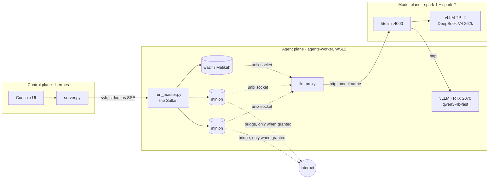

# The Sultan's Court: running a real agent harness on your own rack

*ByteBunker Labs, 30 September 2026*

Two DGX Sparks, a Mac mini, a Windows box with an eight-gigabyte RTX 2070, and a rule I refused to break: **agents never run where a model is served.** This is the story of turning that rack into a system where a master agent delegates research to a court of smaller agents, verifies what comes back, and reports to me, with every step visible in a console I can read from the sofa. It is also a story about how much slower and stranger real agent work is than the demos, and what it took to make it finish.

## The rack, and the rule

The two Sparks are not two servers. They are one tensor-parallel vLLM engine over the direct link between them, serving a DeepSeek-V4 vision model at a 262k-token window, with a litellm gateway in front so everything talks to one OpenAI-compatible endpoint by model name. The Mac mini runs the console: a stdlib-only Python server and one JavaScript file, no framework, no build step. The Windows box runs the agents, inside a WSL2 Ubuntu with rootless podman. Its RTX 2070 sat idle until last night.

The rule came from reading NVIDIA's agent-safety guidance and then looking at my own setup. An agent that can run shell commands and fetch web pages is, by construction, a thing that can be talked into doing something dumb. It should not be on the same host as the model weights, and it should not be on the host that holds my keys. So the deployment has three planes:

- **Model plane.** The Sparks serve tokens and nothing else.
- **Control plane.** The console launches goals over ssh and watches. It runs no agent code.
- **Agent plane.** The worker runs one container per agent, with no network by default. A container reaches the model only through a unix socket mounted into it, which a proxy on the worker forwards to the gateway. Roles that genuinely need the internet get a bridge network for that spawn only.

Every agent has a stop button in the console. Stopping a goal kills the master's process group and sweeps any container labelled with it. I tested that path more times than I would like to admit.

## The court

The harness has a master and a roster of archetypes. I named the master **the Sultan**, because a master that "delegates and never does the work" needed a name that made the doctrine obvious. The court:

- **Minions** are fast doers: six tool steps, a small output cap, hidden reasoning off, read, write, run and fetch. The Sultan spawns as many as a task has independent parts.
- **The wazir** is the deep thinker: reasoning on at maximum effort, read-only plus network, spawned one at a time when a question is contested or needs decomposing.
- **Malikah**, the queen, judges the Sultan's synthesis before a human sees it. If she says REVISE, the Sultan applies the corrections and resubmits once.
- **Skeptic panels** are independent contexts that try to refute an agent's answer. They vote; a strict majority passes.

The doctrine lives in standing instructions I edit in the console: when to use quick depth, when to give research agents a longer timeout, which skill to attach for a CVE lookup. The Sultan reads them on every run and names its own agents (Tariq, Iris, Jack, Leo, Mina, Nico showed up in the logs).

## How it works, in detail

**Launch.** The Agents screen posts a goal. `server.py` opens one ssh session to the worker and starts `run_master.py` inside `setsid`, with a sidecar that watches the session's stdin: if the console drops the connection or you press Stop, the sidecar kills the process group and sweeps every container labelled with it. Stdout streams back as server-sent events with a keepalive every five seconds, so a silent run notices a gone client.

**Spawn.** For each agent the Sultan writes a task directory (brief, material, skill bodies, tool allowlist, model name, output cap, context budget, thinking switch) and runs `podman run --network none --userns=keep-id` from the `bytebunker-slave` image, bind-mounting the task directory and a unix socket. The socket is an LLM proxy on the worker that forwards to the gateway, so a container has exactly one way to reach a model and no way to reach anything else. Roles that need the web (`researcher`, `minion` with a research skill) get a bridge network for that spawn only; the worker's allowlist decides which roles may ask.

**Route.** The gateway is litellm on spark-1. Every engine is a name there: `deepseek-v4-vision-uncensored` is the two-Spark tensor-parallel vLLM launched by our `rack` CLI from a recipe file (that recipe is also where the model's default thinking mode lives, `--default-chat-template-kwargs '{"thinking":true, ...}'`, which is why agents have to switch it off explicitly); `qwen3-4b-fast` is the RTX 2070 inside the worker's own WSL2, exposed through a Windows port forward. The harness picks the model per role: `master_model` for the Sultan, `thinking_model` for wazir, Malikah and skeptics, `default_slave_model` for everyone else.

**Run.** Inside a container the runner loops gather → act → verify with a per-depth step budget (quick 6, standard 30, deep 60) and a time budget from the spawn. It trims old tool output past a character budget, checkpoints `result.json` every step, nudges at two steps left, offers only `submit_result` on the last step, salvages a truncated or prose submission, and skips its own verifier when out of time, handing the answer back marked unverified. Every step is an event line in `/tmp/bb-<agent>/events.jsonl` on the worker, which the console tails for the live cards.

**Decide.** The Sultan sees results as labels: `ok`, `ANSWERED but UNVERIFIED`, or `failed`. It can `get_result`, `verify_result` (a parallel skeptic panel on the thinking model), `steer_slave`, `kill_slave`, or spawn more. A long report is written once as prose and referenced as `@draft`. Every round is traced to `trajectories/<goal>/master.jsonl`; every spawn's outcome to `trajectories/spawns.jsonl`.

**Watch.** The console reads those files over ssh: the Sultan's decisions, live agents keyed to running containers, finished agents with brief, answer, evidence, unknowns and timeline, and a Cluster card with containers, masters, 24-hour outcomes and tokens. The worker also reports its own model server's `/metrics` and `nvidia-smi`, which is how the 2070 shows up next to the Sparks. The console's own trace log records every chat, tool call, rating, agent run and recipe action, and `/api/export` turns it into training data.

**Configure.** Three surfaces: the console's `config.json` (gateway, model capabilities, skills dirs, agents host and doctrine, run cap, litellm and rack hosts), the harness's `config.yaml` on the worker (models per role, output caps, context budgets, thinking switches, concurrency, podman), and litellm's `model_list` on the gateway host.

## What actually happened

The demo goal was deliberately multi-step: three Citrix NetScaler CVEs, a sourced fact sheet for each, exploitation status from CISA's catalog, then a prioritised patch plan for an administrator running both ADC and Gateway. It took four launches to finish. Each one found a different way to fail, and each failure was a real design lesson.

**Launch one: the re-spawn loop.** Standard-depth researchers on this engine ran fifteen minutes and 140k to 170k tokens each, then ran out of time before their self-check. They returned full answers with five sources each, marked `success=false, unverified`. The Sultan read "failed" and spawned the same brief again. The fix was a vocabulary change: an unverified answer is now presented to the master as material to cross-check with a skeptic panel or a wazir, never as a failure to redo.

**Launch two: the silent hour.** All eight agents delivered. Then the console's fixed one-hour cap killed the master while it was writing the synthesis, as prose, in three rounds of two to four minutes each. Nothing had traced those rounds, so a master composing a report was indistinguishable from a hung one. Now every master round is traced with its duration, tokens and either the tools it called or the prose it wrote; prose gets a pointed nudge; and the run cap is a setting, three hours by default.

**Launch three: the cut-off handoff.** The Sultan's synthesis for Malikah was 4000 tokens, exactly the master's output cap, so the tool call arrived as `spawn_slave({})`. It adapted on its own the second time, reached Malikah, got a REVISE with three minor items, ran panels, and then its final answer was cut at the same cap and delivered as an empty string. Two fixes: a long report is written once as a plain message and referenced as `@draft` from the tool call, and a reply that hits the cap is named as such to the model instead of silently losing the call.

**Launch four: done in 89 minutes.** Three minions for the facts, three skeptic panels, follow-up minions for what the panels asked, synthesis, Malikah twice, a final report with sources and an honest unknowns list. Exit 0.

| Run 4 | |
|---|---|
| Agents spawned | 12 |
| Wall clock | 89 min |
| Engine output rate, all requests combined | 27 tokens/s |
| Median request | 9,700 tokens in, 900 out, 51 s |

That last row is the whole explanation for the question I kept asking myself: why is this so slow? One engine, shared by every running agent, at about seven tokens per second per stream, with a pipeline that is serial by design. Research, then panels, then follow-ups, then synthesis, then a deep review, then the report.

## Making it faster without making it worse

The first speed-up was hiding in plain sight. DeepSeek reasons by default. A minion's tool-call step, which should be a hundred tokens, was carrying hundreds of hidden reasoning tokens at seven per second. The harness now switches reasoning off explicitly for every role that is not supposed to think, and for the skeptics, whose verdicts are short JSON objects. Skeptics also vote in parallel now, with an output cap.

The second speed-up was the 2070. vLLM has no Windows build, but the GPU is visible inside WSL2, so the worker's own box serves a four-billion-parameter AWQ Qwen3 model with tool calling on, a 24k window, and room for three agents at once. Single-stream it does 81 tokens per second, about twelve times what a minion saw on the shared engine. A new `thinking_model` setting routes the wazir, Malikah and the panels to the Spark while minions use the small model.

Then it got the answer wrong. NVD and CVE.org serve bot-gated HTML; the small model read "checking your browser" as "CVE not found". I fixed the method, not the prompt: the research skill now goes to the JSON APIs, and two deterministic tools do the dangerous parts. `cve_record` returns one CVE's record from CVE.org and NVD flattened into quotable lines. `kev_lookup` reads CISA's whole catalog and matches the id exactly, because a clipped feed had shown the model its neighbours and it reported the wrong CVE as exploited. Give a small model sharp tools, not more prompt.

The rerun was correct: two minions on the 2070, six minutes end to end, and the KEV verdict came from the feed itself.

## Seeing what the agents are doing

The complaint that started all of this was "I can't see what my agents are doing." The console now shows the Sultan's decisions live: each round, how long the model took, which tools it called, what it wrote when it wrote prose, every spawn and every result with its label (success, answered but unverified, failed). Every agent, live or finished, opens on the right side of the screen with its brief, answer, evidence, unknowns, error and full event timeline. The Cluster screen has an agents card (containers, masters, live agents, last-24-hour outcomes and tokens) and a node card for the 2070 next to the Sparks. Everything the console does is written to a trace log that exports as training data.

## Deploying models from the console

Last night's vLLM install was a sequence of ssh sessions, a missing C compiler, a systemd unit written by hand, a Windows port forward, and an edit to the gateway's config. That is the wrong shape for something anyone else should be able to do. The console now has a **Recipes** screen for the hosts that had nothing: a recipe is a parameter form that renders the exact files it would run, so you read the install script, the serve script, the unit and the gateway entry before anything executes. Deploy runs it over ssh with the log streamed into the page; Register appends the entry to litellm and restarts it. The 2070's model server now runs under a unit the recipe wrote, redeployed from the button. The Sparks are different: they already have `rack`, our serving CLI, whose recipe files decide solo versus tensor-parallel and register the model with the gateway. The console does not re-invent that; it lists rack's recipes, shows the file, and runs `rack up`, `rack down`, `status` and `logs` with the output streamed into the page.

There is also a one-command installer for the console itself, and an architecture document with the plan to fold the console, the harness and the recipes into one package with one skills directory and one config. That merge needs a licence decision, because the harness is private today.

## What I would tell someone starting this

- Measure the engine before tuning the agents. Tokens per second across all requests, median request size and latency, prefix-cache hit rate. Every slow thing I chased was explained by four numbers.
- A slave that cannot finish must still hand back what it has. Checkpoint every step, salvage truncated submissions, salvage prose, mark it unverified. Losing an answer costs more than a wrong one you can check.
- The master's vocabulary matters. "Failed" makes it redo. "Answered, unverified" makes it verify.
- Trace the master's rounds. Silence is the most expensive state a run can be in.
- Small models are fine doers if the dangerous steps are tools, not judgment calls.
- Keep the agents off the model hosts and off the control host. It costs one extra machine and buys you sleep.

## Next

Merge the repos, make the recipes data rather than code, and get a second doer engine on the rack so the panels stop queueing behind the minions. The court works. Now it needs to be easy to raise one.
